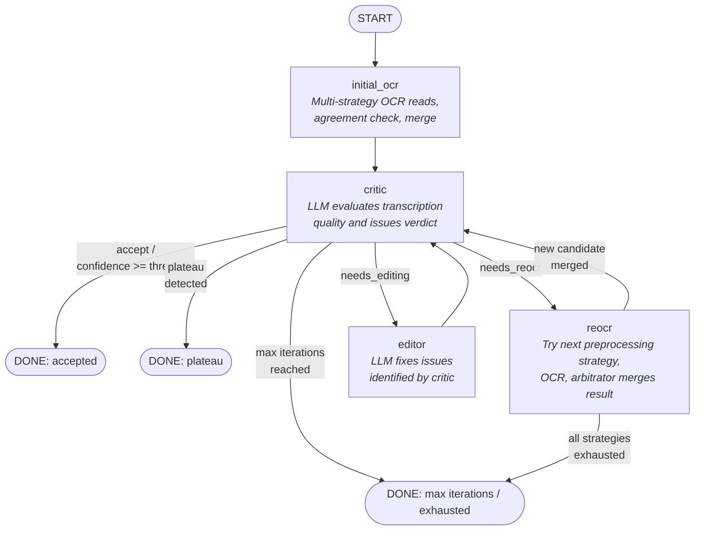

# Handwritten Notes OCR

A local-first OCR pipeline for converting handwritten notes to text using vision-language models. Runs entirely on your machine (Apple Silicon MPS, NVIDIA CUDA, or CPU).

## Setup

Requires Python 3.10+ and [Poetry](https://python-poetry.org/docs/#installation).

```bash
# Install dependencies
poetry install

# (Optional) Include Jupyter/notebook support
poetry install --extras notebooks
```

Copy `.env.example` to `.env` and add your [HuggingFace token](https://huggingface.co/settings/tokens) — required for downloading gated models:

```bash
cp .env.example .env
# Edit .env and set HF_TOKEN=your_token_here
```

## CLI Commands

```bash
# Single image
ocr path/to/image.jpg

# With ground truth comparison
ocr path/to/image.jpg --ground-truth path/to/gt.md

# Custom thresholds
ocr path/to/image.jpg --max-iterations 15 --accept-threshold 90

# Batch (all images in a folder)
ocr path/to/folder/ --output-dir results/

# Standalone evaluation
python -m ocr_agent.eval_final path/to/transcription.txt --ground-truth path/to/gt.md
```

If you prefer not to use the script entry point, `python -m ocr_agent` works identically to `ocr`.

## Pipeline Architecture

The pipeline is implemented as a [LangGraph](https://langchain-ai.github.io/langgraph/) state graph. Each node is a self-contained step that reads from and writes to shared `OCRState`.



**Phase 1 — Initial OCR** (`initial_ocr`): Runs OCR with two preprocessing strategies, compares agreement, optionally adds a tiebreaker third read, then majority-vote merges all candidates.

**Phase 2 — Critique-Edit Loop** (`critic` ↔ `editor` / `reocr`): The critic LLM evaluates the current transcription and returns a verdict:
- **accept** — confidence meets threshold, pipeline is done.
- **needs_editing** — routes to the editor LLM which fixes identified issues, then loops back to critic.
- **needs_reocr** — routes to re-OCR with an unused preprocessing strategy, the arbitrator LLM merges the new reading with current best, then loops back to critic.

The loop exits on acceptance, plateau (no improvement for N iterations), max iterations, or strategy exhaustion.
